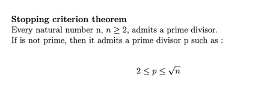

Digital Product School: Technical challenge
---

Prime age calculator.
When a user enters their birth year, the next year when their age will be a prime number should be displayed.

For example, the user entered 2011, 2024 is displayed (because he’ll be 13 then).

---

I based my solution on this theorem:

So it test all possibilities between 2 and \sqrt + 1 from the today age.

When an age is a prime number the script stops and print the chosen year.

---

_To run the script_

`python main.py`

